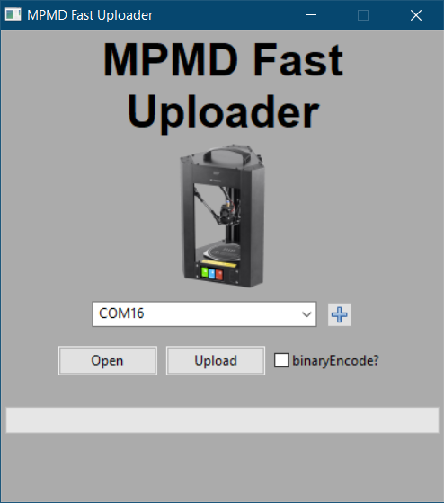

# MarlinBGC
Utilities for encoding/decoding/uploading binary g-code files for use with Marlin4MPMD firmware Firmware

There are 3 separate utilities in this repository:

## MPMDFastUpload
Single-purpose GUI for uploading .gcode and .bgc files using the fast upload capability of Marlin4MPMD.  Can upload to SD up to 15x faster than the stock firmware.

### Instructions
1.  Select the correct communication port from the drop-down menu, press the + button to refresh available ports
2.  Click the open button to select the .gcode or .bgc file to upload
3.  (Optional) select the binaryEncode button to automatically encode the .gcode file to a compressed binary format which can reduce transfer times by at least 50%
4.  Press the Upload button to start the data transfer

## encodeBinGcode
Command-line utility for encoding .gcode files into .bgc

*`encodeBinGcode <gcodeFilePathIn> <bgFilePathOut>`*

example:

`encodeBinGcode 20mmCube.gcode 20mmCube.bgc`
## M34_sendBinGcode
Command-line utility for uploading .gcode or .bgc files to the MPMD using fast-serial transfer

*`M34_sendBinGcode <ComPort> <BaudRate> <FilePath>`*

example:

`M34_BinGcode COM3 115200 20mmCube.bgc`